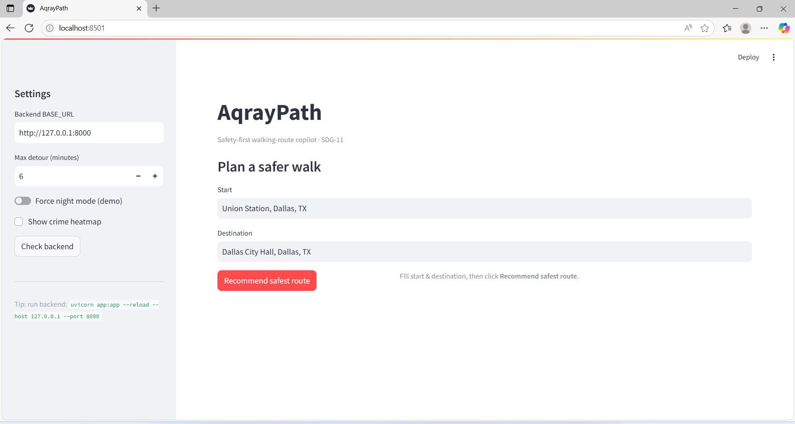
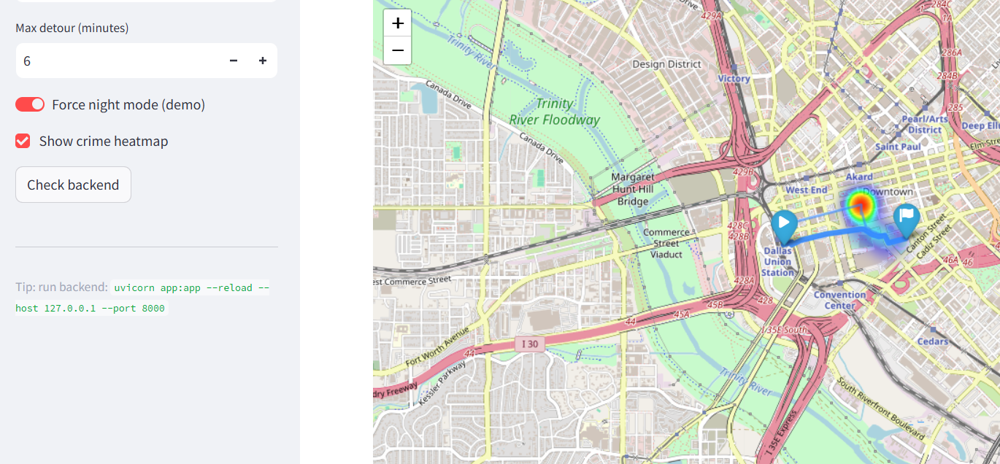
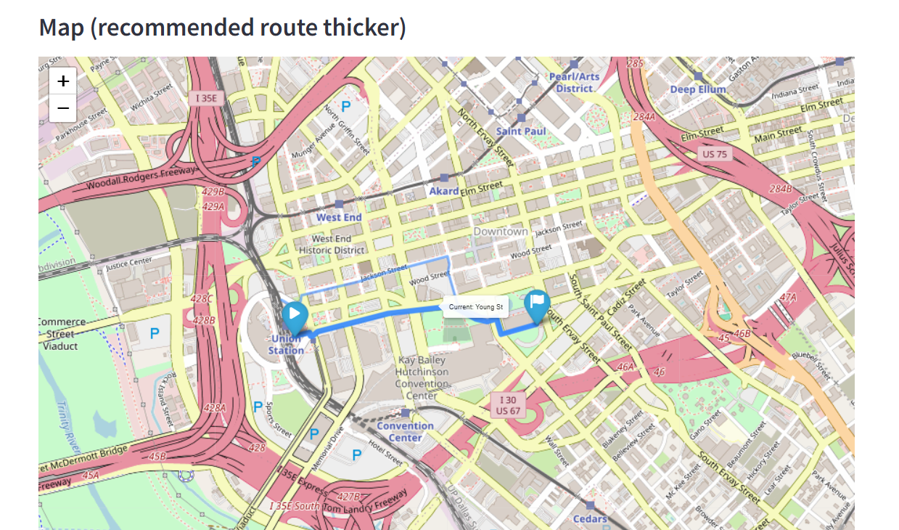
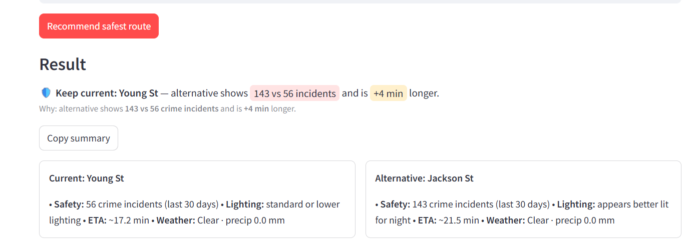

# AqrayPath 🚶‍♀️🛡️

**Safety-first walking router for SDG 11 (Sustainable Cities & Communities)**  
Built with **FastAPI**, **Streamlit**, **IBM watsonx.ai**, **Google Maps**, **Open-Meteo**, and **Dallas Open Data**.  
AqrayPath helps pedestrians choose the *safest walking route* by analyzing **crime data**, **weather**, and **lighting conditions** in real time.

---

## ✨ Features
- 🗺️ **Multiple Route Options**: Fetches candidate walking routes from Google Maps.  
- ☁️ **Weather Awareness**: Uses Open-Meteo API to check rain, storms, or harsh weather.  
- 🚨 **Crime Hotspot Detection**: Scores safety with Dallas Open Data (crime incidents).  
- 🌙 **Lighting Awareness**: Adds risk factor for poorly lit areas at night.  
- 🤖 **AI Safety Ranking**: IBM watsonx.ai compares routes and recommends the safest one with reasoning.  
- 🖥️ **Simple UI**: Streamlit app for entering start/destination and viewing results.

---

## Screenshots

### Homepage


### Heatmap on Map


### Recommended Route


### Route Comparison


---

## ⚙️ Tech Stack
- **Backend**: FastAPI (Python)  
- **Frontend**: Streamlit  
- **APIs**:  
  - Google Maps Directions API  
  - Open-Meteo Weather API  
  - Dallas Open Data (Crime data)  
- **AI Agent**: IBM watsonx.ai (deployment scoring routes)  

---

## 🚀 Getting Started

### 1. Clone the Repository
```bash
git clone https://github.com/monikaaaa1111/AqrayPath.git
cd AqrayPath
